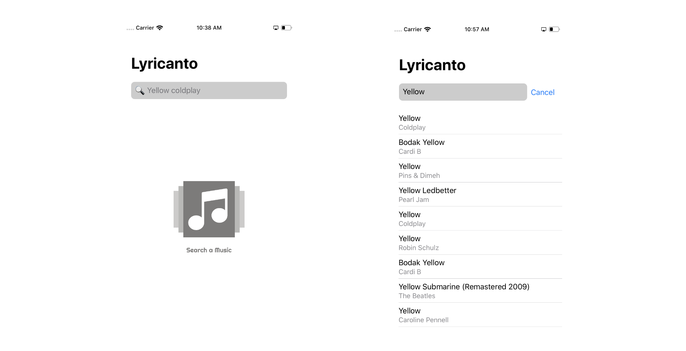
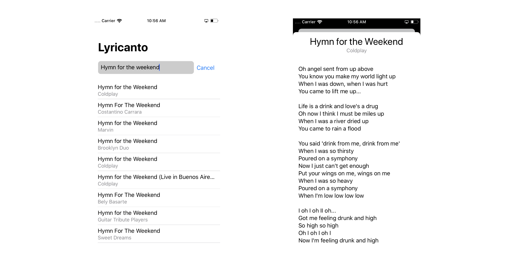

# Lyricanto
An iOS app to you sing everything you want.
_Lyricanto_ uses lyrics.ovh API to get music lyrics of a song.

## Built With
* [SwiftUI](https://developer.apple.com/documentation/swiftui) - Declarative Interface Framework
* [Combine](https://developer.apple.com/documentation/combine) - Event-Processing Operators Framework
* [Lyrics.ovh](https://lyricsovh.docs.apiary.io/) - Song Lyrics APIs

## Screenshots

## License
The project does not need a license :)
